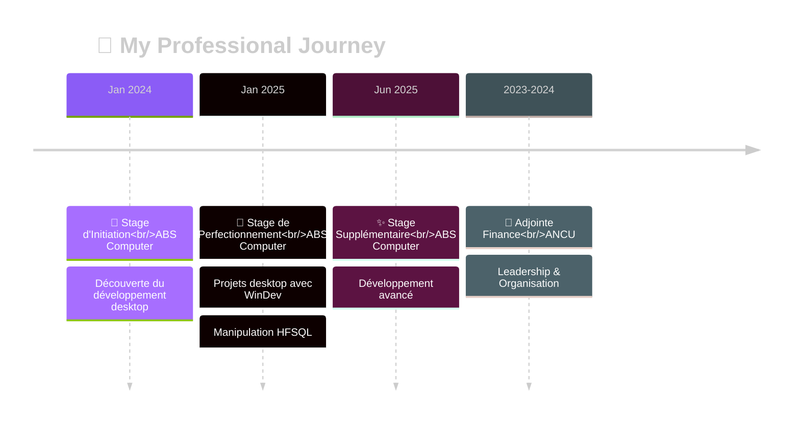

<!-- Animated Header Wave -->


<!-- Typing Animation -->
<p align="center">
  
</p>

<!-- Animated Divider -->


<!-- Profile Views Counter with Animation -->
<p align="center">
  
  
</p>

---

## 🌸 About My Cosmic Journey

```javascript
const mariamAffes = {
    location: "📍 Sfax, Tunisia 🇹🇳",
    currentRole: "🎓 Information Technology Student @ ISET Sfax",
    mission: "🚀 Seeking PFE Internship Opportunity",
    
    dreamJob: "Software Engineer • Full-Stack & Mobile Developer 💻📱",
    
    currentlyLearning: [
        "React.js ⚛️",
        "Django 🐍", 
        "Flutter 🦋",
        "Advanced WinDev 🔧"
    ],
    
    lifePhilosophy: "The universe is expanding... and so are my skills! 🌌✨",
    
    openTo: [
        "Internships (PFE)",
        "Open Source Contributions",
        "Freelance Projects",
        "Tech Collaborations"
    ],
    
    funFact: "I turn ☕ into <code/> and 🐛 into ✨ features!"
};
```

---

<!-- Animated Section Divider -->


## 🛠️ My Tech Galaxy

<div align="center">

### 🌟 Frontend Constellation

<p>

</p>
<p>


</p>

### 🌌 Backend Universe

<p>

</p>
<p>


</p>

### 🪐 Database & DevOps Nebula

<p>

</p>
<p>


</p>

### 💫 WinDev Expertise

<p>


</p>

</div>

---

<!-- Animated Divider -->


## 🚀 Professional Odyssey

<div align="center">



</div>

---

## 📊 GitHub Cosmic Analytics

<div align="center">

<!-- GitHub Stats Cards -->


<!-- GitHub Streak -->


<!-- Activity Graph -->


</div>

---

<!-- Animated Divider -->


## 🏆 GitHub Achievements

<div align="center">

</div>

---

## 💫 Superpowers & Soft Skills

<div align="center">

<table>
<tr>
<td align="center" width="25%">

<br><b>💬 Communication</b>
<br><sub>Effective & Clear</sub>
</td>
<td align="center" width="25%">

<br><b>👥 Teamwork</b>
<br><sub>Collaborative Spirit</sub>
</td>
<td align="center" width="25%">

<br><b>⭐ Leadership</b>
<br><sub>Inspiring Others</sub>
</td>
<td align="center" width="25%">

<br><b>🎨 Creativity</b>
<br><sub>Innovative Thinking</sub>
</td>
</tr>
<tr>
<td align="center" width="25%">

<br><b>⚡ Initiative</b>
<br><sub>Proactive Approach</sub>
</td>
<td align="center" width="25%">

<br><b>📋 Organization</b>
<br><sub>Structured & Efficient</sub>
</td>
<td align="center" width="25%">

<br><b>🧩 Problem Solving</b>
<br><sub>Analytical Mind</sub>
</td>
<td align="center" width="25%">

<br><b>🎯 Autonomy</b>
<br><sub>Self-Driven</sub>
</td>
</tr>
</table>

</div>

---

<!-- Animated Divider -->


## 🌐 Connect Across the Galaxy

<div align="center">

### 💫 Let's Build Something Amazing Together!

<p>
<a href="https://www.linkedin.com/in/mariam-affes">

</a>
<a href="https://github.com/affesmariam">

</a>
<a href="mailto:affes.mariam.webdev@gmail.com">

</a>
</p>

### 📬 I'm Open To:
```
✨ Internship Opportunities (PFE)
🤝 Open Source Collaborations  
💼 Freelance Projects
🚀 Tech Partnerships
```


</div>

---

## 💭 Philosophy & Fun Facts

<div align="center">

### 🌌 *"The universe is expanding... and so are my skills!"*


### ⚡ Quick Facts About Me:
- ☕ I turn **coffee** into `<code/>`
- 🐛 I turn **bugs** into ✨ **features**
- 🌙 I code better when the **moon** is out
- 🚀 My commits have **cosmic** energy
- 💜 **Purple & Blue** are my coding colors

</div>

---

<!-- Footer with Wave Animation -->


<div align="center">

### ✨ Thank You for Visiting My Cosmic Space! ✨

**Feel free to reach out — I respond faster than light! 🌟**


**Made with 💜 and countless ☕ by Mariam Affes**

</div>
