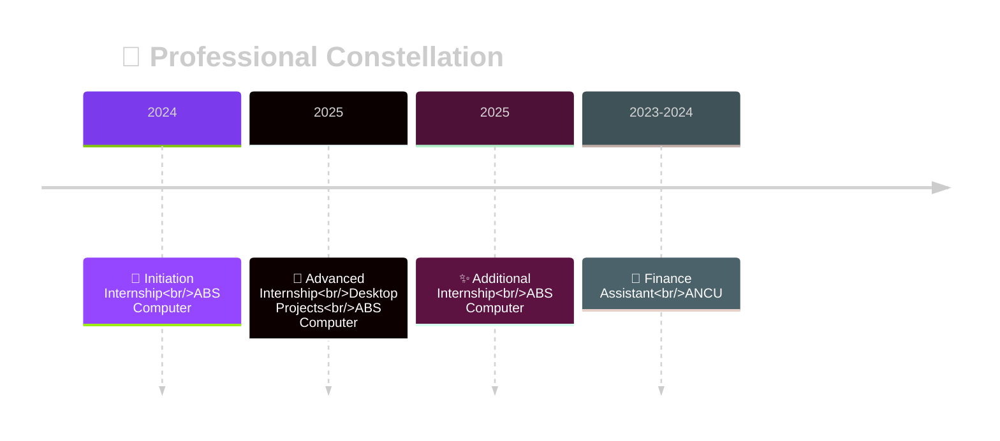

<div align="center">

# 🌌 Welcome to My Cosmic Code Universe 🚀


</div>

---


## 🌸 About My Journey Through the Stars

```typescript
const mariam = {
    location: "🇹🇳 Sfax, Tunisia",
    education: "🎓 ISET Sfax - Computer Science",
    role: "💻 Full-Stack Developer",
    currentMission: "🚀 Seeking PFE Internship",
    
    passions: [
        "Building modern web apps 🌐",
        "Crafting mobile experiences 📱",
        "Turning ideas into reality ✨"
    ],
    
    currentlyExploring: {
        frontend: ["React.js", "Flutter"],
        backend: ["Django", "PHP"],
        database: ["MySQL", "Firebase"]
    },
    
    funFact: "I believe every bug is just a feature waiting to be discovered! 🐛✨"
};
```

<br clear="right"/>

---

## 🎨 My Cosmic Tech Stack

<div align="center">

### 🌟 Frontend Universe
<p>


</p>

### 🌌 Backend Galaxy
<p>


</p>

### 🪐 Database & Tools Constellation
<p>


</p>

### 💫 Programming Languages
<p>


</p>

</div>

---

## 🚀 My Stellar Journey

<div align="center">


```mermaid
%%{init: {'theme':'dark', 'themeVariables': { 'primaryColor':'#7c3aed','primaryTextColor':'#fff','primaryBorderColor':'#a78bfa','lineColor':'#6366f1','secondaryColor':'#4c1d95','tertiaryColor':'#1e1b4b'}}}%%
timeline
    title 🌠 Professional Constellation
    2024 : 🌟 Initiation Internship<br/>ABS Computer
    2025 : 💫 Advanced Internship<br/>Desktop Projects<br/>ABS Computer
    2025 : ✨ Additional Internship<br/>ABS Computer
    2023-2024 : 🤝 Finance Assistant<br/>ANCU
```

</div>

---

## 📊 GitHub Nebula Stats

<div align="center">
  


</div>

---

## 🏆 Cosmic Achievements

<div align="center">


</div>

---

## 💫 Superpowers (Soft Skills)

<div align="center">

<table>
<tr>
<td align="center" width="33%">

<br><b>🌟 Communication</b>
</td>
<td align="center" width="33%">

<br><b>👥 Teamwork</b>
</td>
<td align="center" width="33%">

<br><b>💡 Leadership</b>
</td>
</tr>
<tr>
<td align="center" width="33%">

<br><b>🎨 Creativity</b>
</td>
<td align="center" width="33%">

<br><b>⚡ Initiative</b>
</td>
<td align="center" width="33%">

<br><b>📋 Organization</b>
</td>
</tr>
</table>

</div>

---

## 🌍 Language Constellations

<div align="center">

| Language | Level | Progress |
|----------|-------|----------|
| 🇹🇳 **Arabic** | Native | ████████████ 100% |
| 🇫🇷 **French** | Fluent | ██████████░░ 90% |
| 🇬🇧 **English** | Professional | ████████░░░░ 75% |

</div>

---

## 🔗 Let's Connect Across the Galaxy

<div align="center">

<a href="mailto:affes.mariam.webdev@gmail.com">

</a>
<a href="https://linkedin.com/in/mariam-affes">

</a>
<a href="https://github.com/affesmariam">

</a>

<br><br>


</div>

---

## 💭 Cosmic Wisdom

<div align="center">


</div>

---

<div align="center">

### 🌟 Thanks for Visiting My Universe! 🌟


**✨ "In the universe of code, every bug is a star waiting to shine!" ✨**


</div>
